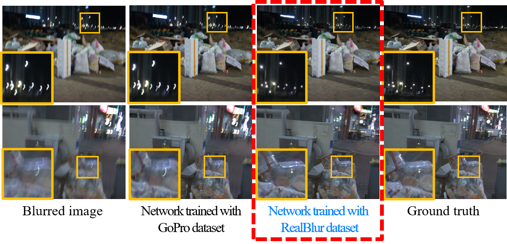

# Real-World Blur Dataset for Learning and Benchmarking Deblurring Algorithms
by Jaesung Rim, Haeyun Lee, Jucheol Won, [Sunghyun Cho](https://www.scho.pe.kr/). [[pdf]](http://cg.postech.ac.kr/research/RealBlur/assets/pdf/RealBlur_eccv2020.pdf) [[project]](http://cg.postech.ac.kr/research/RealBlur/)

### Result of RealBlur Test set


## Installation 


```bash
git clone --recurse-submodules https://github.com/rimchang/RealBlur.git
```

## Prerequisites

We recommend virtual environment using conda or pyenv.

##### SRN-Deblur
- Python2.7
- cuda8.0
- ./SRN-Deblur/requirements.txt

##### DeblurGAN-v2

- Python3.6.3
- cuda9.0
- ./DeblurGAN-v2/requirements.txt


## Download

For testing, download [RealBlur](https://cgdata.postech.ac.kr/sharing/YhKdbtvD0).

For training same as our paper, download [RealBlur](https://cgdata.postech.ac.kr/sharing/YhKdbtvD0), [BSD-B](https://cgdata.postech.ac.kr/sharing/ak2v58DFR), [GoPro](https://cv.snu.ac.kr/~snah/Deblur/dataset/GOPRO_Large.zip).

All datasets should be located in SRN-Deblur/testing_set/, SRN-Deblur/training_set/, DeblurGAN-v2/dataset/. 

Also, we provide [trained models](https://cgdata.postech.ac.kr/sharing/arLpxqXvT). Please move checkpoint files to SRN-Deblur/checkpoints, DeblurGAN-v2/checkpoints.

Please check "link_file.sh" for appropriate linking of directories and files.

If you have a network problem, please use [google drive link](https://drive.google.com/drive/folders/1xUNAAVzLhNQuGriKTk1hrE-MT-H_56fq).


## Training

```bash
# ./SRN-Deblur
python run_model.py --phase=train --batch=16 --lr=1e-4 --model=color --checkpoint_path=RealBlurJ_pre_trained+GOPRO+BSD500 --datalist=datalist/RealBlur_J_train_list.txt,datalist/BSB_B_Centroid_train.txt,datalist/datalist_gopro.txt --pre_trained=./checkpoints/color --load_iteration=523000 --warmup=1 --over_sampling=20000
python run_model.py --phase=train --batch=16 --lr=1e-4 --model=color --checkpoint_path=RealBlurR_pre_trained+GOPRO+BSD500 --datalist=datalist/RealBlur_R_train_list.txt,datalist/BSB_B_Centroid_train.txt,datalist/datalist_gopro.txt --pre_trained=./checkpoints/color --load_iteration=523000 --warmup=1 --over_sampling=20000

# ./DeblurGANv2
python train_RealBlur_J_bsd_gopro_pretrain_ragan_ls.py
python train_RealBlur_R_bsd_gopro_pretrain_ragan_ls.py
```

## Testing

```bash
# ./SRN-Deblur
python run_model.py --phase=test --model=color --checkpoint_path=RealBlurJ_pre_trained+GOPRO+BSD500 --datalist=datalist/RealBlur_J_test_list.txt --height=784 --width=688
python run_model.py --phase=test --model=color --checkpoint_path=RealBlurR_pre_trained+GOPRO+BSD500 --datalist=datalist/RealBlur_R_test_list.txt --height=784 --width=688

# ./DeblurGANv2
python predict.py --img_pattern=./datalist/RealBlur_J_test_list.txt --weights_path=checkpoints/last_deblur_gan_v2_RealBlur_J_bsd_gopro_pretrain_ragan_ls_10000.h5
python predict.py --img_pattern=./datalist/RealBlur_R_test_list.txt --weights_path=checkpoints/last_deblur_gan_v2_RealBlur_R_bsd_gopro_pretrain_ragan_ls_10000.h5
```


## Evaluation

```bash
# python3, skimage == 0.17.2, cv2==4.2.0.32
python evaluation_RealBlur_ecc.py --gt_root=dataset/RealBlur-J_ECC_IMCORR_centroid_itensity_ref --input_dir=RealBlur_J --core=1 
```

## Post-processing

Please go to [post processing](./post_processing)

## License

The RealBlur dataset is released under CC BY 4.0 license.

## Citation

If you use our dataset for your research, please cite our paper.

```bibtex
@inproceedings{rim_2020_ECCV,
 title={Real-World Blur Dataset for Learning and Benchmarking Deblurring Algorithms},
 author={Jaesung Rim, Haeyun Lee, Jucheol Won, Sunghyun Cho},
 booktitle={Proceedings of the European Conference on Computer Vision (ECCV)},
 year={2020}
}
```
