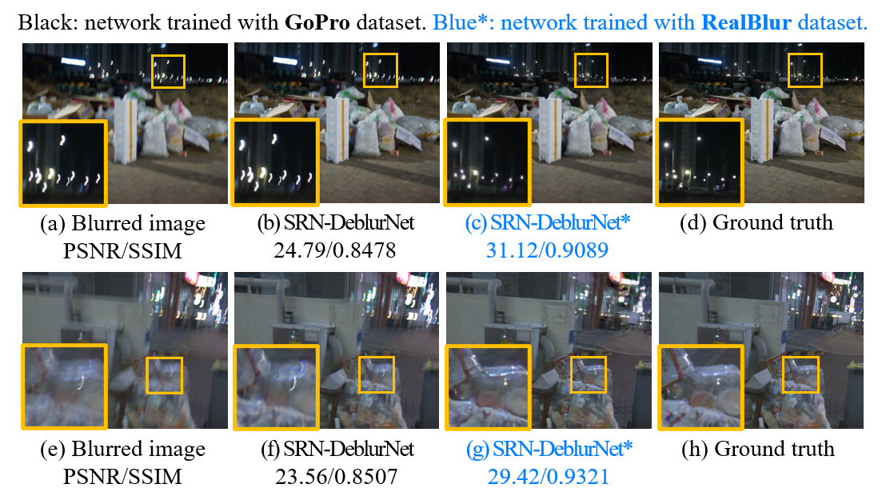

# Real-World Blur Dataset for Learning and Benchmarking Deblurring Algorithms
by Jaesung Rim, Haeyun Lee, Jucheol Won, [Sunghyun Cho](https://www.scho.pe.kr/). (pdf)

### Result on RealBlur Test set


## Pre-trained Model


## Testing

```bash
# ./SRN-DeblurNet
python run_model.py --phase=test --model=color --checkpoint_path=RealBlurJ_pre_trained+GOPRO+BSD500 --datalist=datalist/RealBlur_J_test_list.txt --height=784 --width=688
python run_model.py --phase=test --model=color --checkpoint_path=RealBlurR_pre_trained+GOPRO+BSD500 --datalist=datalist/RealBlur_R_test_list.txt --height=784 --width=688

# ./DeblurGANv2
python predict.py --img_pattern=./datalist/RealBlur_J_test_list.txt --weights_path=checkpoints/last_deblur_gan_v2_RealBlur_J_bsd_gopro_pretrain_ragan_ls_10000.h5
python predict.py --img_pattern=./datalist/RealBlur_R_test_list.txt --weights_path=checkpoints/last_deblur_gan_v2_RealBlur_R_bsd_gopro_pretrain_ragan_ls_10000.h5
```

## Training

```bash
# ./SRN-DeblurNet
python run_model.py --phase=train --batch=16 --lr=1e-4 --model=color --checkpoint_path=RealBlurJ_pre_trained+GOPRO+BSD500 --datalist=datalist/RealBlur_J_train_list.txt,datalist/BSB_B_Centroid_train.txt,datalist/datalist_gopro.txt --pre_trained=./checkpoints/color --load_iteration=523000 --warmup=1 --over_sampling=20000
python run_model.py --phase=train --batch=16 --lr=1e-4 --model=color --checkpoint_path=RealBlurR_pre_trained+GOPRO+BSD500 --datalist=datalist/RealBlur_R_train_list.txt,datalist/BSB_B_Centroid_train.txt,datalist/datalist_gopro.txt --pre_trained=./checkpoints/color --load_iteration=523000 --warmup=1 --over_sampling=20000

# ./DeblurGANv2
python train_RealBlur_J_bsd_gopro_pretrain_ragan_ls.py
python train_RealBlur_R_bsd_gopro_pretrain_ragan_ls.py
```

## Evaluation

```bash
# python3, skimage == 0.17.2, cv2==4.2.0.32
python evaluation_RealBlur_ecc --gt_root=RealBlur-J_ECC_IMCORR_centroid_itensity_ref --result_dir=RealBlur_J --core=1 
```

## Citation

if you use our dataset for your research, please cite our papers.

```bibtex
@inproceedings{rim2020RealBlur,
  title={Real-World Blur Dataset for Learning and Benchmarking Deblurring Algorithms},
  author={Jaesung Rim, Haeyun Lee, Jucheol Won, Sunghyun Cho},
  booktitle={Proceedings of the European Conference on Computer Vision (ECCV)},
  year={2020}
}